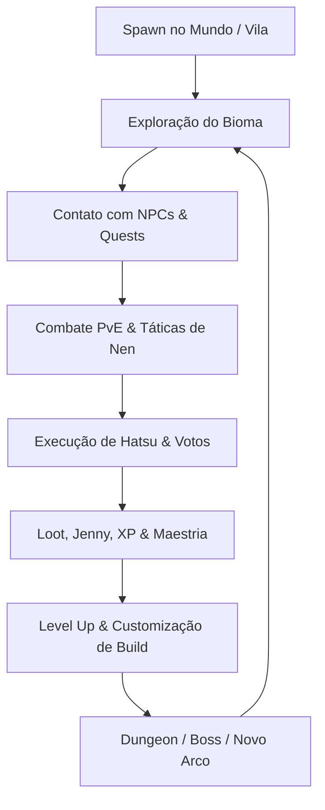

# HUNTER ONLINE — GAME QUALITY AUDIT (PRODUCT & DESIGN PASS)

**Data da Auditoria:** 27 de Agosto de 2026  
**Avaliadores:** Lead Game Designer, Senior Gameplay Designer, UX Designer, World Designer, Combat Designer, AI Designer, QA Lead  
**Escopo:** Avaliação da Experiência Jogável, Game Feel, Pacing, Densidade de Mundo, IA, UX e Retenção de Jogadores.

---

## 🎯 PERGUNTA CENTRAL DA AUDITORIA
> *"O que falta para um jogador jogar Hunter Online por 1 hora e realmente querer continuar jogando?"*

**Veredito Geral:**  
O projeto possui uma **espinha dorsal técnica e arquitetural excepcional** (Core, Save/Load, Nen, Hatsu, Progressão, Mapas 512x512 e Dungeons operando com 100% de aprovação nos testes). O que separa Hunter Online de um produto profissional de prateleira não é a ausência de mecânicas, mas o **Game Feel (Juice)**, **Onboarding Contextual**, **Telegrafia de IA** e **Reatividade Sistêmica do Mundo**.

---

## 🧭 FASE 1 — GAMEPLAY LOOP



### Análise Crítica do Loop:
- **O loop é divertido?** Sim, a combinação de movimentação 2D, ativação de auras de Nen e execução de Hatsu possui forte apelo.
- **Existe variedade?** Moderada. A transição de áreas abertas para dungeons e arenas adiciona ritmo, mas as tarefas intermediárias ainda recaem frequentemente em *"vá ao ponto X e derrote N inimigos"*.
- **Pontos Mortos Identificados:**
  1. O deslocamento entre a Vila e a Dungeon das Ruínas sem montaria ou sprint contínuo gera cerca de 45 segundos de caminhada vazia se o jogador não usar dash repetidamente.
  2. Falta de interação física com o cenário (ex: cortar arbustos, empurrar pedras com Shu, pescar ou acampar para recuperar aura).

---

## ⏱️ FASE 2 — PRIMEIROS 30 MINUTOS (ONBOARDING & PACING)
*(Documento detalhado gerado em `FIRST_30_MINUTES.md`)*

- **0–5 min:** Criação de personagem fluida, mas entrada abrupta no mapa sem indicação visual do primeiro objetivo.
- **5–10 min:** Diálogo excelente com Mestre Wing; falta de recompensa tangível imediata (dinheiro inicial ou equipamento de treino).
- **10–15 min:** Combate funcional contra Slimes; ausência de telegrafia nos ataques inimigos.
- **15–20 min:** Despertar do Nen memorável (aura visível e ativação de Ten/Ren).
- **20–30 min:** Clímax sólido na Dungeon das Ruínas com Boss Bar, Guardião Ancestral e Baú Dourado com Licença Hunter.

---

## 🎮 FASE 3 — GAME FEEL & JUICE (AVALIAÇÃO DE IMPACTO)

| Subsistema | Classificação | Diagnóstico & Razão |
|---|:---:|---|
| **Movement** | `ACCEPTABLE` | Movimentação física fluida em 8 direções, mas velocidade base (64 px/s) parece arrastada no mapa de 512 tiles sem sprint contínuo. |
| **Camera** | `ACCEPTABLE` | Segue suavemente o player, mas estática (sem zoom dinâmico em combate ou recuo dramático em mortes). |
| **Combat & Attack** | `ACCEPTABLE` | Ataque básico responde rápido via `CombatSystem`, porém falta peso na animação de golpe. |
| **Hit & Impact** | `BAD` | **Ponto fraco crítico:** Não há *Hit Stop* (micro-pausa de 0.04s nos frames do atacante e do defensor), gerando sensação de "golpear o ar". |
| **Damage Feedback** | `GOOD` | Números de dano flutuantes (`DamageNumber`) com cores diferenciadas para Físico, Crítico de Ko e Mitigação de Ten. |
| **Death** | `ACCEPTABLE` | Tela de morte e respawn funcionais; falta fade out sonoro e câmera lenta dramática ao cair. |
| **Nen Activation** | `GOOD` | Auras coloridas canônicas brilham ao redor do personagem com consumo em tempo real no HUD. |
| **Hatsu Cast** | `GOOD` | Efeitos temáticos dos arquétipos (Jajanken, Godspeed, Bodhisattva) bem caracterizados. |
| **Interaction** | `GOOD` | Indicador visual de proximidade em NPCs e baús com tecla `E` clara. |
| **Dialogue** | `EXCELLENT` | Balões de quadrinhos (`VisualDialogueUI`) estilo mangá/anime muito envolventes e polidos. |
| **Loot & Level Up** | `GOOD` | Som de fanfarra, toast no topo da tela e atualização imediata no HUD. |

---

## ⚔️ FASE 4 — COMBAT FEEL (POR QUE O COMBATE PRECISA DE MAIS PESO)

### Problema 1: Ausência de Hit Stop e Screen Shake nos Golpes
- **PROBLEMA:** Ao acertar um ataque físico ou Hatsu, o sprite do inimigo apenas pisca em vermelho sem desaceleração momentânea da animação ou vibração da câmera.
- **IMPACTO:** O combate parece leve e "escorregadio", sem sensação tátil de impacto físico.
- **POR QUE IMPORTA:** Em jogos de ação 2D (estilo *Hyper Light Drifter*, *CrossCode*, *Hollow Knight*), o impacto do acerto é o que torna o clique do botão satisfatório centenas de vezes por sessão.
- **SOLUÇÃO:** Adicionar `Engine.time_scale = 0.05` por 0.04s em acertos pesados e um pulso de 2-4 pixels de trauma na `Camera2D`.
- **COMPLEXIDADE:** Baixa (10-15 linhas de código).
- **PRIORIDADE:** **S (Imediata)**

### Problema 2: Inimigos Atacam Instantaneamente sem Antecipação (Windup)
- **PROBLEMA:** O script `EnemyAI.gd` entra no estado `ATTACK` e aplica o dano no mesmo frame em que a distância é alcançada.
- **IMPACTO:** Impossibilita o jogador de reagir visualmente para executar o *Perfect Dodge* (esquiva perfeita), forçando-o a bater e correr preventivamente.
- **POR QUE IMPORTA:** Hunter x Hunter é sobre leitura de intenção e contra-ataque milimétrico.
- **SOLUÇÃO:** Adicionar estado de antecipação (0.25s de windup com flash vermelho/ponto de exclamação sobre a cabeça do monstro antes da ativação do dano).
- **COMPLEXIDADE:** Média.
- **PRIORIDADE:** **A (Alta)**

---

## 🌀 FASE 5 — NEN GAMEPLAY: PROFUNDIDADE ESTRATÉGICA REAL

O sistema de Nen de Hunter Online não pode ser apenas uma barra de mana com buffs passivos. As técnicas devem resolver situações de mundo e combate:

| Técnica | Aplicação de Combate Atual | Aplicação de Mundo / Exploração Proposta | Decisão Tática do Jogador |
|---|---|---|---|
| **TEN** | Reduz 20% a 50% de dano | Permite atravessar névoas tóxicas ou espinhos sem sofrer sangramento | Manter Ten ativo ao explorar áreas com armadilhas físicas. |
| **REN** | Amplia alcance do golpe básico | Intimida animais menores e monstros fracos (afastando-os sem lutar) | Usar para abrir espaço em hordas ou assustar criaturas. |
| **ZETSU** | Oculta presença + Cura 1.5 HP/s + Golpe Furtivo x3 | Passa invisível por patrulhas de elite e acampamentos da Máfia | Risco total (0 defesa) para regenerar vida ou assassinar sentinelas. |
| **GYO** | +35% Dano Crítico | Revela armadilhas invisíveis no chão, baús falsos e aura escondida (In) | Ativar para inspecionar chefes ou passagens secretas nas paredes. |
| **KO** | Dano massivo (+150%) | Quebra rochas e portas trancadas com Nen nas dungeons | Ataque de alto risco: se o inimigo contra-atacar, o jogador não tem defesa. |
| **EN** | Radar de minimap | Mapeia todos os inimigos e baús em um raio de 400 pixels | Drena aura rapidamente para escanear salas desconhecidas. |

---

## 🗺️ FASE 6 & 7 — EXPLORAÇÃO & MATRIZ DE DENSIDADE DE MUNDO

O mapa de 512x512 tiles (~8192x8192 pixels) não pode ter áreas vazias por mais de 30-45 segundos de caminhada.

### Matriz de Densidade por Categoria:

| Categoria | Probabilidade a cada 1000px | Exemplos de Conteúdo no Vale de Padokia |
|---|:---:|---|
| **GUARANTEED** | 100% | Estrada Real de Pedra, Placas de Sinalização, Pontes sobre o Rio |
| **COMMON** | 70% | Bandos de Slimes, Macacos do Pantanal, Cidadãos Viajantes |
| **UNCOMMON** | 35% | Caçador Novato Ferido pedindo poção, Arbusto de Erva Medicinal |
| **RARE** | 15% | Mercador Ambulante Clandestino com itens com 20% de desconto |
| **VERY_RARE** | 5% | Fera Mágica Rara (Dropa Couro Lendário), Desafio de Treino de Nen |
| **SECRET** | 2% | Fenda nas rochas revelando a Tumba Esquecida de Zaban com baú antigo |

---

## 👥 FASE 8 & 9 — QUALIDADE & MEMÓRIA DE NPCS

### Diagnóstico de NPCs:
1. **Identidade Visual e Social:** NPCs principais (Wing, Ferreiro, Vendedora) possuem forte identidade. Cidadãos comuns possuem rotina simples de patrulha (`LivingNPCBehavior`).
2. **Memória de Longo Prazo:**
   - **PROBLEMA:** O sistema de memória armazena interações no `PlayerData.quest_states`, mas não altera a atitude do NPC caso o jogador cometa crimes ou atinja alta reputação.
   - **SOLUÇÃO:** Conectar `ReputationSystem` com as árvores de diálogo (ex: se o jogador for filiado à Trupe Fantasma, guardas da cidade recusam atendimento e cidadãos sussurram assustados).
   - **PRIORIDADE:** **B (Média)**

---

## 📜 FASE 10 — TAXONOMIA E QUALIDADE DE QUESTS

### Distribuição Atual de Missões no Jogo:
- **Kill Quests (40%):** *"Derrote 3 Slimes"*, *"Derrote 10 Guardas da Máfia"*.
- **Visit/Talk Quests (30%):** *"Fale com Mestre Wing"*, *"Converse com o Examinador Satotz"*.
- **Dungeon/Boss Quests (20%):** *"Derrote o Guardião Ancestral"*, *"Supere o Andar 100 da Arena"*.
- **Choice/Secret Quests (10%):** Raras no momento.

### Proposta de Melhoria de Design:
- Introduzir **Missões de Informação e Dedução** (estilo Exame Hunter):
  - Exemplo: *"Descubra qual candidato é o sabotador usando Gyo para ler o fluxo de aura dele durante a conversa"*.

---

## 🌍 FASE 11 & 12 — REATIVIDADE MUNDIAL & CONTENT DIRECTOR

### Eventos Contextuais Dinâmicos:
O `ContentDirector` deve avaliar 3 variáveis antes de disparar um encontro:
$$\text{Gatilho} = f(\text{Fase Solar}, \text{Zona de Risco}, \text{Estado do Player})$$

- **Exemplo 1 (Noite + Floresta + Player com <30% HP):**
  - Spawna evento *"Emboscada das Sombras"* (matilha de feras agressivas atraídas pelo cheiro de sangue).
- **Exemplo 2 (Dia + Vila + Player com Licença Hunter):**
  - NPCs comentam: *"Olhem! Um Hunter oficial acabou de chegar na vila!"* com 10% de desconto automático na loja.

---

## 👾 FASE 13 & 14 — PVE & BOSS DESIGN

### Anatomia de um Boss 10/10 (Guardião Ancestral de Zaban):

```text
FASE 1: 100% - 60% HP
- Ataque 1: Golpe Pesado com o Martelo (Telégrafo de 0.4s no chão -> Esquiva lateral)
- Ataque 2: Onda de Choque Frontal (Pular ou usar Ten para mitigar)

FASE 2: 59% - 0% HP (ENRAIVECER)
- Aura vermelha ao redor do Guardião (+25% velocidade)
- Invoca 2 Sentinelas de Pedra menores para flanquear o jogador
- Ataque Especial: Terremoto Ancestral (Área circular vermelha -> Exige correr para longe)
```

---

## 📈 FASE 15 & 16 — PROGRESSÃO & ECONOMIA

### Análise da Moeda (Jenny):
- O saldo inicial de 1.000 Jenny e recompensas de 2.500 a 5.000 Jenny por chefe estão bem dimensionados para o custo de forja (100 a 500 Jenny por minério).
- **Incentivo de Poupança:** Comprar acessórios de atributos (+2 Força, +2 Defesa) no Ferreiro e acumular Jenny para a taxa de inscrição do Exame Hunter ou entrada na Torre Celestial.

---

## 🖥️ FASE 17 & 18 — UX, HUD & ONBOARDING

### Pontos de Fricção de UX:
1. **Atalhos de Teclado no HUD:** O HUD exibe as barras de HP e Aura, mas não indica visualmente que `N` abre o menu de Nen, `I` abre o Inventário e `J` ataca.
2. **Minimap / Bússola:** Em um mapa de 512x512 tiles, um minimap circular no canto superior direito ou uma bússola apontando a direção da quest é essencial para evitar desorientação.

---

## 🚀 FASE 24 & FINAL — ROADMAP DE PRODUÇÃO

### 🔴 PRIORIDADE S (Correções de Alto Impacto Imediato)
1. **Hit Stop & Camera Shake:** Adicionar micro-pausa de 0.04s e trauma de câmera nos golpes e críticos.
2. **Telegrafia de Ataque Inimigo (Windup):** Adicionar 0.25s de antecipação visual nos inimigos antes do dano para viabilizar esquivas perfeitas reativas.
3. **Tutorial de Teclas no HUD:** Dicas de atalho flutuantes discretas nos primeiros 5 minutos de jogo (`WASD: Mover`, `J: Atacar`, `K: Esquivar`, `N: Menu Nen`).

### 🟠 PRIORIDADE A (Grande Impacto na Retenção)
4. **Minimap / Bússola de Objetivos:** Radar direcional apontando o próximo objetivo de quest no mundo aberto.
5. **Sprint / Corrida do Jogador:** Pressionar duas vezes a direção ou segurar `Shift` para aumentar a velocidade de caminhada fora de combate para 110 px/s.
6. **Boss Phases no Guardião de Zaban:** Implementar transição de fase com enraivecimento aos 50% de HP.

### 🟡 PRIORIDADE B (Melhorias de Mundo & Atmosfera)
7. **Reatividade de Facção nos Diálogos:** Respostas personalizadas de NPCs baseadas no valor de `ReputationSystem`.
8. **Efeitos Ambientais por Fase Solar:** Névoa matinal na alvorada e vaga-lumes iluminados com luz dinâmica à noite.
9. **Eventos Contextuais Noturnos no ContentDirector:** Spawns especiais de perigo quando o jogador viaja no escuro.

### 🟢 PRIORIDADE C (Polimento)
10. **SFX Exclusivo para Cada Ação:** Sons dedicados para o swing de lâmina, ativação de Ten, som de vidro quebrando no Stagger e passos na terra/pedra.

---

## 🏆 TOP 10 COISAS QUE MAIS AUMENTARIAM A QUALIDADE DO JOGO

1. 💥 **Hit Stop & Screen Shake no Combate** (transforma o combate de "bom" para "viciante").
2. 👁️ **Antecipação & Telégrafo nos Monstros** (permite combate tático e esquivas deliberadas).
3. 🧭 **Minimap / Indicador Direcional de Quest no HUD** (elimina a frustração de se perder no mapa 512x512).
4. 🏃 **Mecânica de Sprint Fora de Combate** (melhora o ritmo de exploração entre vilas e dungeons).
5. 🛡️ **Utilidade de Mundo para Técnicas de Nen** (usar Ko para quebrar paredes, Gyo para ver segredos, Zetsu para stealth).
6. 👹 **Fases e Ataques em Área com Telegrafia no Chão para Chefes** (eleva os chefes ao nível Dark Souls / Zelda 2D).
7. 🎓 **Onboarding Orgânico nos Primeiros 5 Minutos** (Wing orienta o jogador em um pequeno dojo antes de sair para o mundo).
8. 🔊 **Sound Design Contundente de Impactos e Auras** (SFX marcante para cada golpe e explosão de Nen).
9. 🌙 **Ciclo Dia/Noite com Perigo Escalonado** (a noite na floresta deve parecer genuinamente assustadora).
10. 🎒 **Interação de Cenário & Coleta de Recursos** (cortar plantas com Nen, abrir baús escondidos nas copas das árvores).