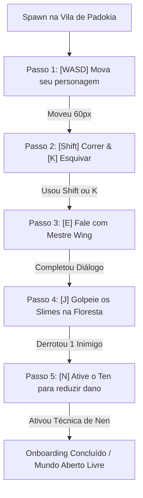

# HUNTER ONLINE — ONBOARDING & TUTORIAL DESIGN (PRIMEIROS 5 MINUTOS)

**Data do Documento:** 27 de Agosto de 2026  
**Filosofia de Design:** *"Show, Don't Tell"* — Aprendizado 100% orgânico através de gameplay ativo e dicas contextuais sutis no HUD, sem congelamento forçado de tela ou paredes de texto.

---

## 🎯 OBJETIVOS DE APRENDIZADO DO JOGADOR

1. **Movimentação Física & Exploração:** Dominar `WASD` / Setas e corrida contínua com `Shift`.
2. **Esquiva Tática com I-Frames:** Entender o tempo de esquiva (`K` / `Espaço`) para escapar de ataques.
3. **Interação com o Mundo & Diálogo:** Usar `E` / `Enter` para falar com NPCs e inspecionar objetos.
4. **Combate & Telegrafia:** Atacar com `J`, observar o aviso visual de ataque dos monstros (`⚠️`) e reagir com contra-ataques.
5. **Nen & Gestão de Aura:** Abrir o menu de Nen (`N`) e ativar técnicas com teclas de atalho (`1: Ten`, `2: Ren`, etc.).

---

## 📈 FLUXO PROGRESSIVO DE ETAPAS (TUTORIAL STEP MACHINE)

---

## 🖥️ ESPECIFICAÇÃO DE UI DO TUTORIAL PROMPT

- **Posicionamento:** Centro-inferior da tela (Y: 180px em 320x240, acima da hotbar de habilidades).
- **Estilo Visual:** Card translúcido com borda ciano suave e ícone de tecla destacado.
- **Animação:** Fade-in suave ao ativar novo objetivo, fade-out com som discreto de confirmação ao concluir.
- **Persistência:** O estado do tutorial é gravado em `PlayerData.quest_states["tutorial_step"]` para evitar repetições desnecessárias ao recarregar saves.