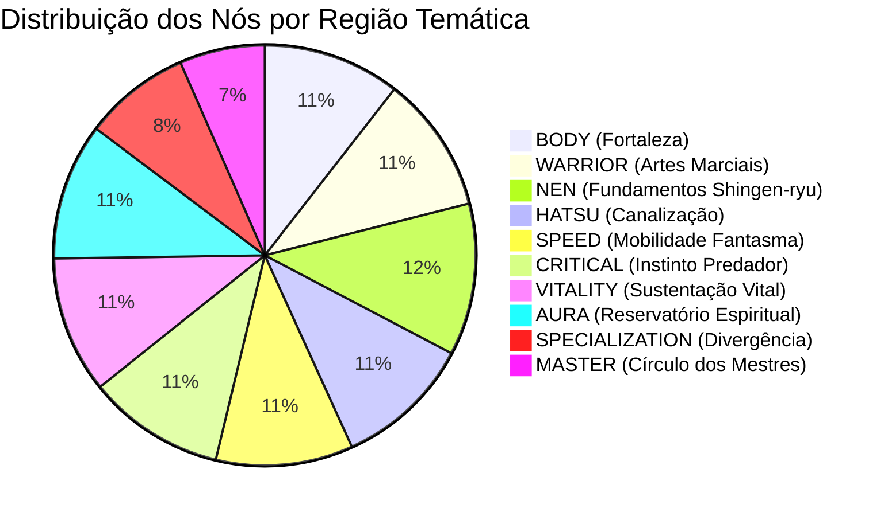

# SKILL TREE SYSTEM BIBLE — CONSTELLATION OF NEN
## HUNTER ONLINE — DEFINITIVE RPG/ARPG PROGRESSION ARCHITECTURE

---

## 1. VISÃO GERAL & FILOSOFIA DE DESIGN

A **Constelação do Nen (Nen Skill Tree)** é o sistema central de especialização e personalização de builds em Hunter Online. Inspirada na filosofia de árvores expansivas de grandes RPGs e ARPGs (Path of Exile, Final Fantasy X Sphere Grid, Grim Dawn), ela rompe definitivamente com formatos lineares e listas simples de desbloqueio.

```text
                  LEVEL UP (1 a 1000+)
                           │
         ┌─────────────────┴─────────────────┐
         ▼                                   ▼
AUTOMATIC BASE STAT GROWTH             +1 SKILL POINT
(HP, Força, Defesa, Vel, Aura)                │
(Poder Natural Intrínseco)                    ▼
                                   INVESTIMENTO NA ÁRVORE
                                              │
                      ┌───────────────────────┴───────────────────────┐
                      ▼                                               ▼
              NÓS PASSIVOS / ATRIBUTOS                        KEYSTONES / MECÂNICAS
              (+% Stats, Regen, Crítico)                    (Alterações de Regras do Jogo)
```

### O Triângulo Sagrado da Progressão
1. **LEVEL = PODER INTRÍNSECO**: O Caçador cresce naturalmente em atributos vitais (HP, Força, Defesa, Velocidade, Aura) ao subir de nível, mesmo que nunca gaste um único Skill Point.
2. **SKILL TREE = ESPECIALIZAÇÃO DE BUILD**: Os Skill Points (+1 por nível, totalizando 999 no Nv. 1000) são a moeda exclusiva de investimento na constelação estelar para direcionar arquétipos (Tank, Brawler, Nuke Hatsu, Crítico, Speedster, Life Steal).
3. **HATSU = HABILIDADE INDIVIDUAL**: Sistema autônomo onde o jogador cria, afina e evolui suas técnicas proprietárias ou absorvidas, sem competir por pontos de atributos da árvore.

---

## 2. TAXONOMIA E TIPOS DE NÓS

A constelação conta com **mais de 400 nós** categorizados em 4 patamares hierárquicos distintos:

| Tipo de Nó | Ranks Máximos | Custo por Rank | Escopo de Bônus | Função de Design |
| :--- | :---: | :---: | :--- | :--- |
| **SMALL NODE** | 1 | 1 SP | +1% a +2% Atributos | Pontes de conexão e pequenos incrementos orgânicos. |
| **MEDIUM NODE** | 1 a 3 | 1 SP | +3% a +4.5% Atributos | Upgrades escaláveis e transições entre ramificações. |
| **MAJOR NODE** | 1 | 1 SP | +8% a +18% Stats Chave | Marcos de especialização regional e identidade de classe. |
| **KEYSTONE NODE** | 1 | 1 SP | Regras Únicas / Tradeoffs | Transforma mecânicas de gameplay (ex: Life Steal, Tradeoffs). |

---

## 3. AS 10 REGIÕES TEMÁTICAS DA CONSTELAÇÃO

Organizadas radialmente ao redor do **Nexus Central (Despertar da Essência)**:



### Detalhamento das Regiões:
1. **Região 1 — Fortaleza Corpórea (BODY)**:
   - *Foco*: Vida Máxima, Defesa Plana/Percentual, Mitigação de Impacto, Armadura Biológica.
   - *Grandes Marcos*: Corpo de Ferro (+12% Defesa, +8% HP), Presença Colossal (+8% Mitigação).
   - *Keystone*: **Baluarte Inabalável** (+25% Defesa, +12% Redução de Dano; -10% Velocidade).
2. **Região 2 — Arte Marcial do Caçador (WARRIOR)**:
   - *Foco*: Dano de Ataque Básico, Cadência de Golpes, Força Fisiológica, Combos.
   - *Grandes Marcos*: Ímpeto do Lutador (+15% Dano Básico), Golpes Pesados (+12% Força).
   - *Keystone*: **Frenesi do Guerreiro** (+30% Dano Básico, +15% Força; -15% Dano de Hatsu).
3. **Região 3 — Fundamentos do Nen (NEN)**:
   - *Foco*: Árvore canônica de Shingen-ryu: Ten I-V, Ren I-V, Zetsu I-V, Gyo I-V, Ko I-V, Shu I, Modos Ryu.
   - *Grandes Marcos*: Ken: Muralha Integral (+15% Defesa, +10% Força), In: Ocultação Refinada (+15% Evasão).
   - *Keystone*: **Domínio Absoluto** (+25% Eficiência de Técnicas, +20% Dano de Nen).
4. **Região 4 — Canalização de Hatsu (HATSU)**:
   - *Foco*: Dano de Hatsu, Redução de Cooldown (CDR), Redução de Custo de Aura, Área de Efeito.
   - *Grandes Marcos*: Ressonância do Hatsu (+15% Dano de Hatsu), Conjuração Instantânea (+12% CDR).
   - *Keystone*: **Sobrecarga de Hatsu** (+35% Dano de Hatsu, +25% Área; +20% Custo de Aura).
5. **Região 5 — Mobilidade Fantasma (SPEED)**:
   - *Foco*: Velocidade de Movimento, Evasão/Esquiva, Agilidade neuromuscular, Bônus pós-esquiva.
   - *Grandes Marcos*: Passo Fantasma (+12% Esquiva, +10% Velocidade), Surto de Adrenalina (+15% Velocidade).
   - *Keystone*: **Reflexos de Relâmpago** (+20% Esquiva, +25% Velocidade; -12% Defesa).
6. **Região 6 — Instinto Predatório & Crítico (CRITICAL)**:
   - *Foco*: Chance Crítica, Multiplicador de Dano Crítico, Execução de Inimigos Vulneráveis.
   - *Grandes Marcos*: Instinto Assassino (+8% Chance Crítica, +25% Dano Crítico), Mestre da Execução (+35% Crítico).
   - *Keystone*: **Canhão de Vidro** (+15% Chance Crítica, +50% Dano Crítico; -20% Defesa).
7. **Região 7 — Sustentação Vital (VITALITY)**:
   - *Foco*: Regeneração Passiva de HP, Life Steal (Drenagem Vital), Cura Recebida.
   - *Grandes Marcos*: Surto Imortal (+25% Regen HP), Toque Vampírico (+5% Life Steal).
   - *Keystone*: **Caçador de Sangue** (10% do Dano Causado é convertido em Vida; -50% Regen fora de combate).
8. **Região 8 — Reservatório Espiritual (AURA)**:
   - *Foco*: Aura Máxima, Taxa de Regeneração de Aura por segundo, Eficiência de microporos.
   - *Grandes Marcos*: Reservatório Infinito (+18% Aura Máx), Torrente Contínua (+25% Regen Aura).
   - *Keystone*: **Fonte Inesgotável** (+40% Regen Aura, +15% Eficiência; -10% Força).
9. **Região 9 — Divergência de Especialização (SPECIALIZATION)**:
   - *Foco*: Keystones únicos, trocas táticas e regras contextuais avançadas.
   - *Keystones*: **Estado de Fluxo** (+35% Regen Aura e +15% Vel após 5s sem dano), **Instinto Predador** (+30% Dano contra HP < 40%), **Vontade Indomável** (+50% Tenacidade contra CC).
10. **Região 10 — Círculo dos Mestres (MASTER)**:
    - *Foco*: Endgame 1000+, nós universais que interligam as bordas extremas das disciplinas.
    - *Keystone*: **Iluminação Shingen-ryu** (+15% a Todos os Atributos, +20% Regen de Vida e Aura).

---

## 4. ATRIBUTOS E EFEITOS SUPORTADOS NA PIPELINE

A Skill Tree interage dinamicamente com a pipeline de `StatModifier` do `PlayerData`:

### Atributos de Combate Ofensivo:
- `forca`: Força base e dano físico direto.
- `dano_ataque_basico`: Multiplicador exclusivo para o combo normal de golpes.
- `dano_fisico`: Bônus percentual aplicado a golpes físicos.
- `dano_nen`: Escalonamento de técnicas fundamentais de Nen.
- `dano_hatsu`: Multiplicador de habilidades especiais criadas e ativas.
- `crit_chance`: Probabilidade de acerto crítico (Base: 5% / 0.05).
- `crit_damage`: Multiplicador de dano no crítico (Base: 150% / 1.50).

### Atributos Defensivos e Sustentação:
- `defesa`: Redução percentual direta do dano físico e equilíbrio postural.
- `reducao_dano`: Mitigação plana/percentual universal pós-defesa.
- `esquiva`: Chance de evadir completamente ataques recebidos.
- `vida_max`: Aumento do reservatório vital do Caçador.
- `regen_hp`: Quantidade de vida regenerada por segundo fora de perigo.
- `life_steal`: Percentual de dano infligido convertido diretamente em cura.

### Atributos Espirituais e Utilitários:
- `aura_max`: Volume total do reservatório de aura do caçador.
- `regen_aura`: Taxa de reposição de aura por segundo.
- `reducao_custo_aura`: Redução percentual de aura gasta ao executar Hatsu.
- `reducao_cooldown`: Aceleração de recarga de técnicas e Hatsu.
- `velocidade`: Velocidade de locomoção em pixels por segundo.
- `zetsu_stealth`: Redução do raio de detecção inimigo.

---

## 5. NAVEGAÇÃO, CÂMERA E PERFORMANCE (60+ FPS)

A interface `NenSkillTreeUI.gd` opera como um mapa interativo contínuo:
- **Pan (Arrastar)**: Clique e arraste com o Botão Esquerdo ou Botão do Meio do mouse.
- **Zoom Contínuo**: Scroll do mouse (Roda para cima/baixo) entre 0.25x (visão panorâmica da galáxia de nós) e 2.2x (detalhe minucioso). O zoom é calculado centrado na posição exata do cursor.
- **Viewport Culling**: Apenas nós e conexões contidos no retângulo visível da tela são desenhados a cada quadro. Isso garante **60 a 144 FPS estáveis** mesmo com mais de 400 nós no grafo.
- **Busca em Tempo Real**: Barra de busca que destaca instantaneamente nós por nome, stat ou tag (ex: "crit", "lifesteal", "defesa").
- **Quick-Jump de Regiões**: Dropdown que move suavemente a câmera até o centro da região selecionada.
- **Modo Tela Cheia**: Botão de expansão para imersão total na constelação.

---

## 6. RESET DA ÁRVORE (RESPEC TOTAL)

O sistema de respec em `NenSkillTree.resetar_arvore()` garante segurança matemática absoluta:
1. Contabiliza cada rank investido em cada nó multiplicado pelo seu custo de pontos.
2. Devolve **100% dos pontos gastos** para `PlayerData.nen_skill_points`.
3. Limpa todos os modificadores de atributos provenientes da Skill Tree (`nen_skill_tree` e `nen_skill_tree_contextual`).
4. Recalcula a pipeline de atributos de forma limpa.
5. **NÃO TOCA**: Nível do Caçador, XP acumulado, Curva de Atributos Base, Nível de Técnicas de Nen e Hatsu permanecem 100% inalterados.

---

## 7. PERSISTÊNCIA & MIGRAÇÃO DE SAVES

O `SaveManager` salva o progresso sob a versão de schema `V2`:
- `nen_skill_tree_version`: 2
- `nen_skill_points`: Saldo atual disponível.
- `nen_skill_tree_progress`: Dicionário `{ node_id: rank }`.
- `nen_ryu_caminho`: Postura de Ryu escolhida.

**Compatibilidade Retroativa**: Saves da versão V1 são lidos sem perda de progresso, mapeando automaticamente os 27 nós legados (`ten_1..5`, `ren_1..5`, `zetsu_1..5`, etc.) e inicializando os nós adicionais com Rank 0.

---

## 8. EXEMPLOS DE BUILDS ARQUETÍPICAS

### Build 1: Fortaleza Inquebrável (Tank Supremo)
- **Caminho**: Nexus → Body Gateway → Ramo de Titânio & Mitigação → Ten I-V → Ken: Muralha Integral → Major: Corpo de Ferro → Keystone: Baluarte Inabalável.
- **Resultado**: Defesa colossal, 30% de redução universal de dano, impossível de ser atordoado.

### Build 2: Assassino Sombra (Crit / Speed / Life Steal)
- **Caminho**: Nexus → Speed Gateway → Evasão → Critical Gateway → Dano Crítico → Zetsu I-V → Major: Instinto Assassino → Keystone: Caçador de Sangue.
- **Resultado**: Alta velocidade, 30%+ de chance crítica, furtividade máxima e autocura contínua pelo dano infligido.

### Build 3: Mestre Bombardeiro (Hatsu Overcharge)
- **Caminho**: Nexus → Hatsu Gateway → Dano de Hatsu & CDR → Aura Gateway → Reservatório Infinito → Major: Ressonância → Keystone: Sobrecarga de Hatsu.
- **Resultado**: Habilidades de Hatsu com dano massivo de área (+50% dano total), grande reservatório de aura para sustentação.
