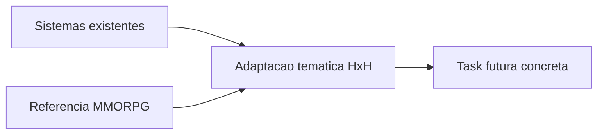

# MMO FEATURES BACKLOG — Hunter Online

> **O que é:** inventário priorizado de sistemas MMO *futuros* (Tier S/A/B), adaptados a HxH.  
> **Não é:** roadmap de produção do dia a dia → ver [`PRODUCTION_ROADMAP.md`](PRODUCTION_ROADMAP.md).  
> **Diretriz:** qualidade de gameplay > quantidade de sistemas — estender autoloads/UIs existentes.  
> **Alinhamento:** [`PRODUCTION_ROADMAP.md`](PRODUCTION_ROADMAP.md) · [`LIVE_OPS_CONTENT.md`](LIVE_OPS_CONTENT.md) · [`../multiplayer/MULTIPLAYER_GAMEPLAY.md`](../multiplayer/MULTIPLAYER_GAMEPLAY.md)

---

## Pré-requisitos multiplayer (bloquear Tier S social/PvP/raid)

Estas duas fundações devem avançar **antes** de AH, ranked, raids 8 e matchmaking. Não diluem COMBATE+NEN+HATSU — estabilizam a camada de rede já usada pelo combate autoritativo.

| ID | Pré-requisito | Status atual | Arquivos-alvo | Desbloqueia |
| :--- | :--- | :--- | :--- | :--- |
| **PREREQ-1** | **Sync binário via `NetworkProtocol`** | Parcial — opcodes + serialize dict existem; snapshots/RPC já rodando; empacote binário compacto ainda aberto | [`scripts/network/NetworkProtocol.gd`](../../scripts/network/NetworkProtocol.gd), [`scripts/network/ServerWorldCoordinator.gd`](../../scripts/network/ServerWorldCoordinator.gd), [`autoload/NetworkManager.gd`](../../autoload/NetworkManager.gd), [`docs/multiplayer/NETWORK_PROTOCOL.md`](../multiplayer/NETWORK_PROTOCOL.md) | Leilão Yorknew, ranked Arena, Duty Finder, guild bank sync |
| **PREREQ-2** | **Revive de aliados em combate** (canalização 3s) | `[IMPLEMENTED]` — desmaio 30s + canal 3s + interrupt on hit + tecla E | [`scripts/network/ServerWorldCoordinator.gd`](../../scripts/network/ServerWorldCoordinator.gd), [`autoload/NetworkManager.gd`](../../autoload/NetworkManager.gd), [`autoload/PartyManager.gd`](../../autoload/PartyManager.gd), [`ui/party/PartyHUD.gd`](../../ui/party/PartyHUD.gd) | Raids 8, world bosses co-op sérios, Blacklist open hunt |

**Ordem mínima:** PREREQ-1 (banda/estabilidade) em paralelo com PREREQ-2 (gameplay co-op). Contratos rotativos (Tier A #5) podem avançar offline sem estes pré-requisitos.

---

## Critério de seleção

Só entra no backlog o que (1) soa HxH, (2) reutiliza código existente, (3) cria loop social/endgame sem virar MMO genérico com skin de Nen.

---

## Tier S — alto fit HxH + base pronta

### S1. Leilão de Yorknew (player marketplace)

| Campo | Valor |
| :--- | :--- |
| **Status** | `BACKLOG` |
| **Inspiração** | Auction House (WoW/FFXIV) + Grand Exchange (OSRS) |
| **Deps** | PREREQ-1; economia server-side estável |
| **Reusar** | `autoload/Economy.gd`, `ui/Shop/ShopUI.gd`, `world/maps/YorknewCityMap.gd`, `scripts/network/*` |
| **Tasks** | Listagens autoritativas no server · taxa Jenny · UI de leilão em Yorknew · escrow de item · filtros raridade/Nen · anti-duplicação por UID |

### S2. Heaven’s Arena ranqueada + temporadas

| Campo | Valor |
| :--- | :--- |
| **Status** | `BACKLOG` (`[FUTURE]` em MULTIPLAYER_GAMEPLAY) |
| **Inspiração** | Arena ladders (WoW), ranked seasons (Blade & Soul / Lost Ark) |
| **Deps** | PREREQ-1; duelos estáveis |
| **Reusar** | `ui/Arena/HeavensArenaTowerUI.gd`, `scripts/systems/arena/ArenaGhostRegistry.gd`, `scripts/network/DuelSystem.gd` |
| **Tasks** | ELO/MMR por andar · fila 1v1 · reset cosmético de temporada · leaderboard · recompensas cosméticas (sem power creep) |

### S3. Revive + Raids 8 hunters

| Campo | Valor |
| :--- | :--- |
| **Status** | Revive `IMPLEMENTED` · Raids `PLANNED` |
| **Inspiração** | Alliance/raids (FFXIV/WoW), guardian raids (Lost Ark) |
| **Deps** | **PREREQ-2** (obrigatório); party/threat/loot já existem |
| **Reusar** | `autoload/PartyManager.gd`, `scripts/network/CoopDungeonInstance.gd`, `scripts/network/CoopWorldBossCoordinator.gd` |
| **Tasks** | Canalização revive 3s · party até 8 só em instância raid · 1 raid vertical (Ruínas → depois Continente Negro) · enrage/fases |

### S4. Greed Island jogável (não só binder)

| Campo | Valor |
| :--- | :--- |
| **Status** | `BACKLOG` (mapa + binder existem) |
| **Inspiração** | Triple Triad / Mahjong (FFXIV), card PvP + mapa meta (GW2) |
| **Deps** | Conteúdo de saga GI; ranked opcional depois |
| **Reusar** | `ui/GreedIslandBinder/`, `resource/greed_island/`, `world/maps/GreedIslandMap.gd` |
| **Tasks** | Duelo de cartas (subset 20–40) · “roubo” consentido · missões de caça a cartas · gate Hatsu do design |

---

## Tier A — forte identidade, estende sistemas atuais

### A5. Associação Hunter: contratos rotativos

| Campo | Valor |
| :--- | :--- |
| **Status** | `[IMPLEMENTED]` — rotação diária B/A/S + Star Hunter semanal + gate de licença + refresh 1× grátis/dia |
| **Inspiração** | Hunt Marks / Roulettes (FFXIV), World Quests (WoW), Bounties (Destiny) |
| **Deps** | Nenhuma rede pesada |
| **Reusar** | `autoload/BountySystem.gd`, `ui/Bounties/BountiesBoardUI.gd`, `resource/quest/RadiantQuestGenerator.gd`, `scripts/missions/QuestManager.gd` |
| **Tasks** | ✅ Reset diário/semanal · ✅ tiers licença B/A/S · ✅ Jenny + rep + material · ✅ Star Hunter weekly · suite `scratch/test_a5_association_contracts_suite.tscn` |

### A6. Guildas de Caçadores (player orgs)

| Campo | Valor |
| :--- | :--- |
| **Status** | `BACKLOG` |
| **Inspiração** | Guilds + Free Companies (FFXIV) + syndicates (Warframe) |
| **Deps** | PREREQ-1; chat multiplayer estável |
| **Reusar** | `autoload/FactionManager.gd`, `autoload/ReputationSystem.gd`, `autoload/PartyManager.gd`, `ui/chat/`, `world/maps/PlayerHouse.gd` |
| **Tasks** | Criar/convidar/kick · bank compartilhado · hall no hub/casa · perks cosméticos/sociais · `NenContractManager` (HATSU_CREATOR_BIBLE PLANNED) |

### A7. Caça Blacklist co-op (open hunt)

| Campo | Valor |
| :--- | :--- |
| **Status** | `BACKLOG` |
| **Inspiração** | World bosses / rare elites (GW2, WoW) + wanted posters |
| **Deps** | PREREQ-2 recomendado; world boss coordinator |
| **Reusar** | `autoload/BountySystem.gd`, `ui/Bounties/`, `scripts/network/CoopWorldBossCoordinator.gd`, `autoload/RumorSystem.gd` |
| **Tasks** | Alvos S-rank por evento · threat multi-party · loot por contribuição · pistas/rumores para localizar |

### A8. Gourmet Hunter life skills

| Campo | Valor |
| :--- | :--- |
| **Status** | `BACKLOG` |
| **Inspiração** | Life skills (BDO), crafting/gathering (FFXIV/ESO) |
| **Deps** | Facção Gourmet; manter leve vs árvore de Nen |
| **Reusar** | `autoload/FactionManager.gd`, `ui/Blacksmith/`, `ui/Minigames/` |
| **Tasks** | Coleta/caça de ingredientes → cooking com buffs temporários · writs diários Gourmet |

---

## Tier B — depois (pilar social maduro)

| ID | Sistema | Inspiração | Adaptação HxH | Deps | Nota |
| :--- | :--- | :--- | :--- | :--- | :--- |
| B9 | Mail + Friends | WoW/FFXIV | Correio da Associação + lista de caçadores | PREREQ-1 | RelationshipSystem hoje é NPC |
| B10 | Matchmaking Duty Finder | FFXIV | Fila dungeon/raid/arena | **PREREQ-1** | Master registry local já existe; falta fila de conteúdo |
| B11 | Territory wars | New World / GW2 WvW | Rotas Associação×Máfia×Salteadores | LiveEventManager | Expandir evento da ponte para meta semanal |
| B12 | Mounts / dirigível | FFXIV mounts | Skins via `TravelSystem` | TravelSystem | Preferir viagem temática, não mount genérico |
| B13 | Seasons / battle pass | Destiny / Lost Ark | Temporada de caçada + códex parcial | LIVE_OPS_CONTENT | Cosmético only |
| B14 | Sockets / Nen stones | WoW/PoE | Gems no enhance +10 | Blacksmith | Risco de power creep |
| B15 | Corpse run / gear loss | classic WoW | **Evitar** | — | Conflita com death soft + duelos sem pena |

---

## Explicitamente fora de escopo (agora)

- Housing MMO completo (já existe `PlayerHouse` pessoal).
- Battlegrounds / world PvP aberto (PvP só consensual).
- Battle pass pay-to-win / cash shop.
- Novos sistemas de combate paralelos a Nen/Hatsu.

---

## Ordem sugerida de execução

1. **PREREQ-1** — sync binário / compressão estável em `NetworkProtocol` + coordenador.
2. **PREREQ-2** — revive aliado (canalização 3s) ✅
3. **A5** — contratos rotativos + Star Hunter ✅
4. **S3** — raid 8 vertical (1 masmorra).
5. **S2** — Arena ranqueada + 1ª temporada.
6. **S1** — Leilão Yorknew (economia server-side estável).
7. **S4** — Greed Island duelo de cartas.
8. **A6** — Guildas + Nen Contracts.
9. **A8 + B11** — Gourmet life skills + meta territorial faccional.

---

## Legenda de status

| Tag | Significado |
| :--- | :--- |
| `BACKLOG` | Especificado aqui; não iniciado |
| `IN PROGRESS` | Parcialmente no código / docs de multiplayer |
| `PLANNED` / `FUTURE` | Já citado em bibles/multiplayer docs |
| `DONE` | (reservado) quando uma task for entregue — atualizar esta tabela |
